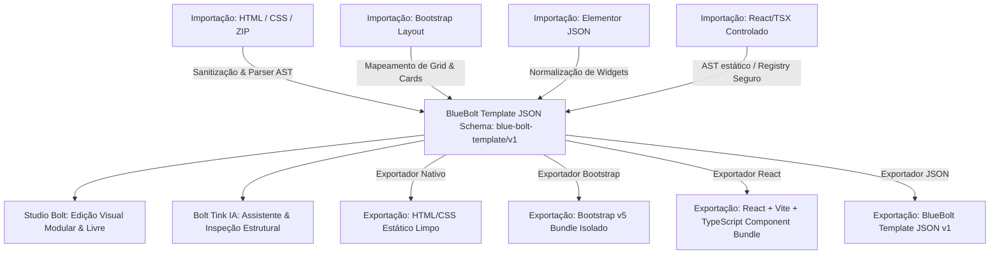
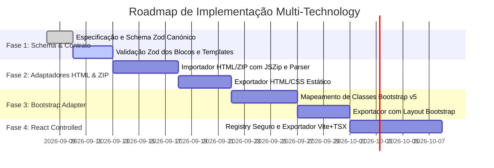

# Arquitetura Blue Bolt Multi-Technology — Especificação Canónica

> **Documento:** Especificação Técnica de Compatibilidade Multi-Tecnologia  
> **Versão do Documento:** 1.0.0  
> **Schema Canónico:** `blue-bolt-template/v1`  
> **Data:** Setembro de 2026  
> **Estado:** Fase de Especificação e Planeamento  

---

## 1. Princípio Central e Filosofia da Plataforma

O **Blue Bolt Page Studio** baseia-se no princípio fundamental de **Documento Canónico Único**.

Qualquer projeto importado ou criado no Blue Bolt é convertido, validado e armazenado exclusivamente sob a estrutura do **BlueBolt Template JSON**. 

HTML estático, CSS, Bootstrap, Elementor JSON, React/TSX e JavaScript são tratados como **formatos de entrada, adaptadores de layout ou destinos de exportação** — nunca como fonte direta de verdade descontrolada.



---

## 2. Schema Canónico `blue-bolt-template/v1`

O documento JSON canónico é estritamente tipado e validado via **Zod**. Qualquer campo não reconhecido ou malicioso é rejeitado ou descartado antes de entrar no estado da aplicação.

### 2.1 Estrutura TypeScript e Validação Zod

```typescript
import { z } from 'zod'

// 1. Metadados de Licença e Atribuição de Terceiros
export const LicenseMetadataSchema = z.object({
  originalName: z.string(),
  version: z.string(),
  source: z.string().url(),
  license: z.enum(['MIT', 'Apache-2.0', 'BSD-3-Clause', 'GPL-3.0', 'CC-BY-4.0', 'Proprietary', 'Public Domain']),
  copyright: z.string(),
  attributionNotice: z.string().optional(),
})

// 2. Metadados Gerais do Template
export const TemplateMetadataSchema = z.object({
  id: z.string().min(1),
  name: z.string().min(1),
  slug: z.string().regex(/^[a-z0-9-]+$/),
  category: z.enum(['Portfólios', 'Landing Pages', 'SaaS e Software', 'Comércio Local', 'Blog & Notícias', 'E-commerce']),
  status: z.enum(['draft', 'published', 'archived']),
  originTechnology: z.enum(['blue-bolt-json', 'html-static', 'bootstrap', 'elementor-json', 'react-controlled']),
  schemaVersion: z.literal('blue-bolt-template/v1'),
  sectionCount: z.number().int().nonnegative(),
  versionCount: z.number().int().positive().default(1),
  author: z.string().default('Blue Bolt Studio'),
  license: LicenseMetadataSchema.optional(),
  createdAt: z.string().datetime(),
  updatedAt: z.string().datetime(),
})

// 3. Tokens de Tema Global e Tipografia
export const ThemeTokensSchema = z.object({
  bg0: z.string(),
  bg1: z.string(),
  bg2: z.string(),
  bg3: z.string(),
  text0: z.string(),
  text1: z.string(),
  text2: z.string(),
  accent: z.string(),
  accentDim: z.string(),
  borderDefault: z.string(),
  fontSans: z.string(),
  fontDisplay: z.string(),
  fontMono: z.string(),
  radius: z.number().nonnegative(),
  radiusLg: z.number().nonnegative(),
})

// 4. Transformações e Posicionamento Livre por Breakpoint
export const FreeTransformSchema = z.object({
  x: z.number(),
  y: z.number(),
  width: z.union([z.number(), z.string()]).optional(),
  height: z.union([z.number(), z.string()]).optional(),
  rotation: z.number().optional(),
  zIndex: z.number().int().optional(),
})

export const ElementResponsiveLayoutSchema = z.object({
  mode: z.enum(['structured', 'free']).default('structured'),
  desktop: FreeTransformSchema.optional(),
  tablet: FreeTransformSchema.optional(),
  mobile: FreeTransformSchema.optional(),
})

// 5. Bloco Canónico Blue Bolt
export const BlockConfigSchema = z.object({
  id: z.string().min(1),
  type: z.enum([
    'navbar',
    'hero',
    'features',
    'services-grid',
    'portfolio-grid',
    'timeline',
    'team-grid',
    'logo-strip',
    'pricing',
    'testimonials',
    'stats',
    'faq',
    'team',
    'contact',
    'contact-form',
    'cta',
    'newsletter',
    'logocloud',
    'gallery',
    'footer',
    'divider',
    'banner',
    'content',
    'image',
    'video',
    'project-modal',
  ]),
  variant: z.string().default('default'),
  props: z.record(z.any()),
  elements: z.record(ElementResponsiveLayoutSchema).optional(),
  layout: z.object({
    align: z.enum(['left', 'center', 'right']).optional(),
    ctaWidth: z.enum(['auto', 'full']).optional(),
    reversed: z.boolean().optional(),
    itemOrder: z.array(z.string()).optional(),
  }).optional(),
  customCssScoped: z.string().max(10000).optional(),
})

// 6. Página Canónica
export const PageConfigSchema = z.object({
  id: z.string().min(1),
  name: z.string().min(1),
  slug: z.string().min(1),
  seoTitle: z.string().max(120).optional(),
  seoDescription: z.string().max(320).optional(),
  blocks: z.array(BlockConfigSchema),
})

// 7. Documento Raiz: BlueBolt Template JSON v1
export const BlueBoltTemplateJsonSchema = z.object({
  schemaVersion: z.literal('blue-bolt-template/v1'),
  metadata: TemplateMetadataSchema,
  theme: ThemeTokensSchema,
  pages: z.array(PageConfigSchema).min(1),
  assets: z.array(z.object({
    id: z.string(),
    originalPath: z.string(),
    localPath: z.string(),
    mimeType: z.string(),
    sizeBytes: z.number().int().nonnegative(),
    hash: z.string(),
  })).default([]),
  approvedInteractions: z.array(z.enum([
    'mobile-menu',
    'modal-dialog',
    'accordion-toggle',
    'tab-switch',
    'smooth-scroll',
    'form-local-validation',
  ])).default([]),
})

export type BlueBoltTemplateJson = z.infer<typeof BlueBoltTemplateJsonSchema>
```

---

## 3. Matriz de Adaptadores de Importação e Exportação

| Adaptador | Formato de Entrada | Capacidade Suportada | Campos Ignorados / Descartados | Estratégia de Conversão | Risco de Perda de Informação |
|---|---|---|---|---|---|
| `blue-bolt-json` | JSON Schema v1 | Suporte total 1:1, blocos, breakpoints livres e temas. | Campos fora da especificação Zod. | Validação direta por schema e carregamento de estado. | **Nenhum** |
| `html-static` | ZIP contendo `.html`, `.css`, imagens e fontes. | Extração de títulos, parágrafos, imagens locais, botões e listas para blocos nativos correspondentes. | `<script>`, `<iframe>`, handlers `on*`, CSS global conflituante. | Parser de AST HTML (ex.: `parse5`), sanitização estrita, mapeamento heurístico de secções (`<header>`, `<nav>`, `<section>`, `<footer>`). | Baixo/Médio (estilos inline proprietários são convertidos em tokens mais próximos). |
| `bootstrap` | HTML com classes Bootstrap (ex.: `container`, `row`, `col-*`, `navbar-expand-*`, `card`, `modal`). | Mapeamento direto de grelhas, colunas, cartões de serviços, modais e formulários para blocos correspondentes. | Scripts `bootstrap.bundle.js`, dependências de jQuery, tooltips via data-attributes externos. | Reconhecimento semântico de padrões de classe Bootstrap e conversão para o contrato de props Blue Bolt. | Baixo (layout visual é preservado através dos componentes nativos Blue Bolt). |
| `elementor-json` | JSON exportado do Elementor WP. | Seções, colunas, headings, text-editor, button, image, icon-box, form. | Widgets específicos do ecossistema WordPress (ex.: shortcodes de plugins de terceiros). | Mapeamento determinístico de widgets Elementor para os blocos nativos Blue Bolt. | Médio (efeitos de movimento proprietários do Elementor são convertidos em transições Tailwind padrão). |
| `react-controlled` *(Planeado)* | Componentes TSX estáticos de um Registry Homologado. | Prop-types declarativos, composição de blocos e temas dinâmicos. | Efeitos colaterais arbitrários (`useEffect` com chamadas `fetch` a URLs externos não homologados, mutações diretas do DOM). | Análise estática da AST TSX via Babel Parser sem execução de código dinâmico; encaixe nas props validadas por Zod. | Baixo |

---

## 4. Estratégia por Tecnologia

### 4.1 HTML e CSS Estático
* **Isolamento de Estilos:** Nenhum arquivo CSS importado de terceiros é inserido como folha de estilos global do Studio. Estilos úteis são extraídos para variáveis locais (`customCssScoped` ou tokens de tema).
* **Sanitização:** Todo nó HTML é sanitizado antes de qualquer análise. Tags `<script>`, tags `<base>`, atributos `href="javascript:..."` e `onerror/onload` são purgados.
* **Exportação:** O JSON Blue Bolt pode ser exportado para um arquivo `index.html` limpo com CSS puro e responsivo.

### 4.2 Bootstrap (Adaptador de Layout)
* **Regra Anti-Conflito:** O arquivo `bootstrap.min.css` **nunca é carregado globalmente** no editor do Blue Bolt Studio para não corromper o design system interno e os estilos Tailwind.
* **Reconhecimento Semântico:** O adaptador identifica classes como:
  * `row` + `col-md-4` $\rightarrow$ `grid grid-cols-1 md:grid-cols-3`
  * `navbar navbar-expand-lg` $\rightarrow$ Bloco `navbar` com menu mobile nativo
  * `modal fade` $\rightarrow$ Modais de projeto gerenciados por acessibilidade nativa (`Escape`, foco)
  * `btn btn-primary` $\rightarrow$ Botão com token de cor de destaque (`#ffc800` / `accent`)

### 4.3 React e TypeScript
* **Execução Segura:** Componentes React externos **nunca** são executados diretamente via `eval` ou carregamento dinâmico sem sandbox.
* **Catálogo Aprovado:** Toda renderização no Studio ocorre através de componentes internos devidamente registrados no `src/blocks/registry.tsx`.
* **Exportação Futura:** O exportador React gerará um projeto limpo com Vite + React 19 + TypeScript, sem dependências proprietárias do editor.

### 4.4 JavaScript e Interações
A plataforma opera com 3 níveis estritos de isolamento:
1. **Nível 0 — Sem JavaScript (Estático):** Páginas 100% estáticas (HTML sem scripts).
2. **Nível 1 — Interações Aprovadas (Nativas React):** Apenas comportamentos seguros do contrato:
   - Abertura/fecho de menu mobile;
   - Modais acessíveis com tecla `Escape` e retorno de foco;
   - Acordeões / FAQ;
   - Abas e carrosséis;
   - Validação local de formulários;
   - Scroll suave para âncoras (`#services`, `#about`).
3. **Nível 2 — JavaScript Personalizado (Futuro / Sandbox Isolado):** Execução estritamente isolada em `iframe` com atributo `sandbox="allow-scripts"` sem acesso a cookies, localStorage ou API do Studio, dependente de permissão de administrador.

### 4.5 Node.js (Serviços de Backend Isolados)
* **Uso Exclusivo:** O ambiente Node.js existe estritamente no backend/serverless para:
  - Interação segura com a API do Gemini via chaves de servidor;
  - Processamento e validação de uploads de ZIPs;
  - Sanitização e validação de esquemas Zod;
  - Compilação e empacotamento de exportações.
* **Proibição Absoluta:** Ficheiros `.js`, `.mjs`, `.sh` ou código Node contidos em arquivos ZIP enviados por utilizadores **jamais** são executados no servidor.

---

## 5. Regras Inegociáveis de Segurança e Sandbox

1. **Zero `eval` e Execução Dinâmica:** Proibido o uso de `eval()`, `new Function()`, `setTimeout(string)` ou injeção direta de `innerHTML` sem sanitização.
2. **Sem CDNs Externas Não Auditadas:** Não injetar Bootstrap, jQuery, Font Awesome ou Google Fonts através de CDNs dinâmicas não autorizadas.
3. **Proteção Anti-Zip Slip:** Rejeição imediata de arquivos ZIP contendo referências `../`, caminhos absolutos `/` ou `\` e caracteres de escape.
4. **Isolamento de Chaves:** Chaves de API (ex.: Gemini) permanecem no ambiente de backend. Nenhuma credencial é exposta no bundle do cliente.
5. **Transparência de Formulários:** Formulários de demonstração em templates importados não realizam disparos externos não autenticados e mostram o aviso honesto *"Envio ainda não configurado"*.

---

## 6. Gestão de Templates com Identificação Multi-Tecnologia

Na interface de **Definições → Gestão de Templates**, cada modelo exibe o cartão de tecnologia enriquecido com:

```text
┌─────────────────────────────────────────────────────────────┐
│ Agency — Portfólio e Serviços                               │
│ Origem: Importação HTML/ZIP (Start Bootstrap)               │
│ Tecnologia de Base: Bootstrap v5 / HTML5 Sanitizado         │
│ Schema: blue-bolt-template/v1 | Status: Rascunho           │
│ Compatibilidade: Studio Bolt (Total) | Bolt Tink IA (Total) │
│ Licença: MIT (Start Bootstrap LLC)                          │
│ Interações: Modais acessíveis, Menu Mobile, Form Local      │
└─────────────────────────────────────────────────────────────┘
```

---

## 7. Auditoria do `package.json` e Tabela de Bibliotecas

Para suportar a evolução multi-tecnologia com estabilidade, segurança e mínimo impacto no bundle, foi realizada uma auditoria completa das dependências atuais face aos requisitos técnicos.

### 7.1 Tabela de Avaliação Técnica de Dependências

| Pacote Proposto | Versão Exata | Licença | Onde Será Utilizado | Impacto no Bundle | Alternativa Zero-Dependency | Risco de Segurança | Já Existe no Projeto? | Recomendação |
|---|---|---|---|---|---|---|---|---|
| **`zod`** | `^3.24.2` | MIT | Validação em tempo de execução do schema canónico `blue-bolt-template/v1`, importadores JSON e props de blocos. | ~12 KB (gzipped, tree-shakeable) | Validadores manuais com funções `typeof` e validações em cascata (sujeito a bugs e manutenção complexa). | **Muito Baixo** (0 vulnerabilidades conhecidas, biblioteca padrão da indústria). | **Não** | **Instalar (Essencial para a fonte de verdade canónica)** |
| **`jszip`** | `^3.10.1` | MIT / GPLv3 | Leitura e descompressão binária controlada de arquivos `.zip` em memória para o importador HTML/ZIP. | ~28 KB (carregamento dinâmico `import()`) | Parser binário manual DataView/Uint8Array (já prototipado, mas limitado a compressão Store/Deflate simples). | **Baixo** (sem execução de código; apenas extração de bytes). | **Não** | **Instalar (Otimiza importação de arquivos ZIP complexos)** |
| **`parse5`** | `^7.2.1` | MIT | Criação da Árvore de Sintaxe Abstrata (AST) de arquivos HTML importados sem execução de scripts. | ~35 KB (backend ou chunk de importação dinâmico) | `DOMParser` nativo do browser (requer isolamento para evitar injeção e execução de scripts inline). | **Muito Baixo** (parser estrito sem engine de execução). | **Não** | **Avaliar para Fase 2 (Importador Avançado)** |
| **`sanitize-html`**| `^2.14.0` | MIT | Sanitização profunda de strings HTML importadas com lista branca estrita de tags e atributos permitidos. | ~45 KB (apenas no módulo de importação) | Regex/Sanitização manual com DOMPurify ou `DOMParser` local seguro. | **Baixo** | **Não** | **Avaliar para Fase 2 (DOMPurify é mais leve no browser)** |
| **`postcss`** | `^8.5.3` | MIT | Análise de seletores CSS importados para renomeação e escopo local (`scoped-css`). | ~80 KB (processamento de importação) | Parser regex de CSS local para prefixação de seletores. | **Baixo** | **Não** (Usado internamente pelo Tailwind, não exposto diretamente) | **Adiar para Fase 3** |
| **`@babel/parser`** | `^7.26.9` | MIT | Análise estática da AST de arquivos React/TSX importados no modo controlado. | ~150 KB (apenas em ferramentas administrativas) | Expressões regulares ou TypeScript Compiler API. | **Muito Baixo** (apenas parser estático). | **Não** | **Adiar para Fase 4 (React Controlled)** |
| **`@dnd-kit/*`** | `^6.3.1` / `^10.0.0` | MIT | Drag & Drop visual nos painéis de camadas e reordenação de secções. | Já integrado | HTML Drag and Drop nativo. | **Muito Baixo** | **Sim (`@dnd-kit/core`, `@dnd-kit/sortable`, `@dnd-kit/utilities`)** | **Manter existente** |
| **`@google/genai`** | `^0.1.1` | Apache-2.0 | SDK oficial Gemini para execução no backend seguro. | 0 KB no cliente (apenas rotas server-side `api/generate.ts`) | Chamadas diretas via `fetch()` REST nativo para o endpoint da Google AI. | **Baixo** | **Não** (Backend usa chamada REST estruturada) | **Manter chamada REST nativa no backend** |

---

## 8. Cronograma de Implementação por Fases



---

## 9. Próximos Passos Imediatos

1. **Aprovação do Utilizador:** Aguardar aprovação formal desta especificação e da tabela de bibliotecas propostas (`zod` e `jszip`).
2. **Instalação Controlada:** Instalação apenas dos pacotes aprovados, com versões fixadas no lockfile.
3. **Auditoria e Verificação:**
   - Execução de `npx tsc --noEmit`
   - Execução de `npm run build`
   - Execução de `git diff --check`
   - Execução de `npm audit`
