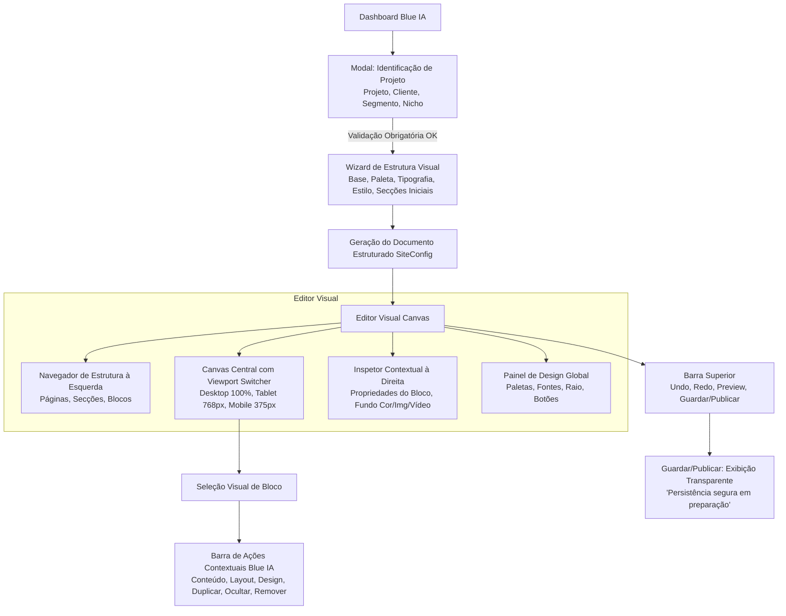

# Especificação Técnica e Arquitetura — Blue IA Visual Editor

> **Documento de Engenharia & Arquitetura Visual**  
> Versão: `1.0.0` | Data: `07/09/2026`  
> Status: **Aguardando Aprovação para Implementação**  
> Referência de Projeto: `Blue Bolt Page Studio / Blue IA`

---

## 1. Visão Geral e Princípios Fundamentais

O **Blue IA Visual Editor** é a solução nativa e proprietária da Blue Bolt para estruturação, customização e gestão visual de páginas e landing pages de alta conversão.

### Diretrizes de Engenharia e Governança
1. **JSON-First & Determinismo:** A estrutura visual da página é regida por um modelo de dados tipado e imutável. Alterações visuais são transformações puras na árvore de secções e blocos.
2. **Design System Blue Bolt Mandatório:** Todas as cores, tipografias, espaçamentos, elevações e componentes obedecem estritamente a `docs/DESIGN_SYSTEM_BLUE_BOLT.md` (`Inter`, HSL semantic tokens, `.glass-card`, `.glow-blue`, etc.).
3. **Seleção Direta sem Exposição de JSON:** O utilizador interage diretamente com os elementos visuais na página; o editor de JSON bruto deixa de ser o fluxo primário e passa a ser apenas uma ferramenta avançada/técnica recolhível.
4. **Segurança e Persistência Controlada:** Nenhuma gravação automática silenciosa ou escrita direta no banco é feita sem validação e autorização explícita server-side.
5. **Zero Novas Dependências nesta Fase:** Reutilização total da stack instalada (`React 19`, `Tailwind CSS v4`, `Zustand 5`, `Immer 11`, `@dnd-kit`, `Lucide React`).

---

## 2. Fluxo Completo de Criação e Edição



### 2.1. Etapa 1: Identificação e Criação Guiada
- **Entrada de Dados de Negócio:**
  - `Nome do Projeto` (Obrigatório, min 3 caracteres).
  - `Cliente / Conta` (Obrigatório).
  - `Segmento de Mercado` (Dropdown tipado com categorias de negócio).
  - `Ramo de Atividade / Nicho Específico` (Obrigatório).
- **Validação de Formulário:** Bloqueio de avanço com feedback inline visual imediato até que todos os campos obrigatórios sejam preenchidos.

### 2.2. Etapa 2: Estrutura Visual Inicial (Setup Step)
Antes de abrir o canvas em branco, o utilizador configura o alicerce visual:
1. **Base / Template de Estrutura:** Escolha de esqueleto inicial (ex: *Landing Page Institucional*, *Página de Vendas Direta*, *Captura de Leads*, *Lançamento de Produto* ou *Em Branco*).
2. **Paleta de Identidade:** Seleção da paleta primária (Azul Blue Bolt clássico, Indigo Tech, Emerald Growth, Slate Minimal, etc.).
3. **Tipografia:** Escolha da combinação de títulos e corpo baseada na escala `Inter` da casa.
4. **Estilo Visual Geral:** Definição do acabamento visual (Moderno com Glassmorphism, Clean Corporativo, High-Contrast Dark).
5. **Geração Inicial da Árvore de Secções:** O sistema compõe a sequência inicial de secções (ex: `Navbar` → `Hero` → `Features` → `Social Proof` → `Pricing` → `CTA` → `Footer`).

### 2.3. Etapa 3: Canvas Central e Navegação
- **Canvas Real:** A página é renderizada em tempo real dentro do frame de visualização responsivo (`Desktop 100%`, `Tablet 768px`, `Mobile 375px`).
- **Seleção Visual:** Ao clicar numa secção ou elemento:
  - Aplica-se a moldura de seleção da Blue Bolt (`border-primary`, indicador de tipo e identificador).
  - Sincroniza instantaneamente o Inspetor à direita para os atributos daquele bloco.
  - Sincroniza o item em foco no Navegador de Estrutura à esquerda.
- **Barra de Ações Contextuais:**
  - ✏️ **Editar Conteúdo:** Foco nos textos e elementos do bloco.
  - 📐 **Editar Layout:** Ajustes de alinhamento, padding vertical/horizontal e largura de container.
  - 🎨 **Editar Design / Fundo:** Fundo com abas (*Cor Sólida/Gradiente*, *Imagem*, *Vídeo*).
  - 📋 **Duplicar:** Cria cópia exata logo abaixo com ID único.
  - 👁️ **Ocultar / Exibir:** Alterna visibilidade (`hidden: true/false`) sem remover da árvore.
  - 🗑️ **Remover:** Aciona confirmação em 2 etapas com foco destrutivo seguro.

### 2.4. Etapa 4: Painel de Design Global
Acessível a qualquer momento para ditar os tokens da página:
- **Paleta de Cores:** Primária, Fundo, Superfícies de Cartão, Acentos.
- **Tipografia:** Peso dos títulos, espaçamento entre linhas e escala de leitura.
- **Bordas e Arredondamento:** Raio global (`rounded-sm` [8px], `rounded-md` [10px], `rounded-lg` [12px]).
- **Botões da Casa:** Variantes globais (`default`, `secondary`, `outline`, `glass`).

### 2.5. Etapa 5: Barra de Ferramentas Superior & Persistência
- **Controlos de Histórico:** Desfazer (`Ctrl+Z`) e Refazer (`Ctrl+Shift+Z` / `Ctrl+Y`) em memória com pilha semântica.
- **Alternador de Viewport:** Botões com visualização Desktop, Tablet e Mobile com transições suaves.
- **Modo Pré-visualização:** Oculta todas as molduras, barras laterais e cabeçalhos do editor para inspecionar a página final em tela cheia.
- **Guardar e Publicar:** Apresenta modal/toast com estado transparente:
  > *"Persistência segura em preparação: as revisões locais estão ativas na sessão. A gravação permanente será ativada na disponibilização da API segura."*

---

## 3. Arquitetura de Componentes

A estrutura de componentes no frontend é organizada de forma modular, respeitando a separação entre UI, Gestão de Estado e Componentes de Bloco:

```
src/
├── routes/
│   ├── Dashboard.tsx            # Ponto de entrada com criação guiada
│   └── Editor.tsx               # Rota principal do editor visual
├── editor/
│   ├── EditorLayout.tsx         # Shell responsivo (TopNav, Left, Center, Right)
│   ├── CanvasToolbar.tsx        # Barra de ferramentas superior (Undo, Viewports, Preview, Guardar)
│   ├── Canvas.tsx               # Área central de rolagem e contenção do canvas
│   ├── ViewportFrame.tsx        # Moldura de viewport (Desktop/Tablet/Mobile)
│   ├── BlockWrapper.tsx         # Moldura de seleção, hover e barra flutuante de ações
│   ├── BlockContextBar.tsx      # Ações contextuais (Conteúdo, Layout, Design, Duplicar, Ocultar, Remover)
│   ├── LeftSidebar.tsx          # Barra lateral esquerda modular
│   │   ├── StructureTree.tsx    # Árvore hierárquica (Páginas > Secções > Blocos)
│   │   ├── SectionLibrary.tsx   # Gaveta de adicionar novas secções
│   │   └── GlobalDesignTab.tsx  # Painel de Design Global (Paletas, Fontes, Raio)
│   ├── RightSidebar.tsx         # Barra lateral direita modular
│   │   ├── InspectorHeader.tsx  # Cabeçalho do bloco selecionado com tipo e status
│   │   ├── BackgroundEditor.tsx # Controlo de Fundo (Cor, Imagem, Vídeo)
│   │   ├── LayoutControls.tsx   # Controlos de Espaçamento e Alinhamento
│   │   └── PropertiesPanel.tsx  # Edição de campos de texto, botões e listas
│   └── modals/
│       ├── DeleteConfirmModal.tsx # Modal de confirmação para remoção de secção
│       └── SafeSaveModal.tsx      # Modal informativo de persistência segura
├── blocks/                      # Registo de blocos visuais Blue Bolt
│   ├── registry.tsx             # Mapeamento dinâmico type -> Component
│   ├── types.ts                 # Schemas e tipagens TypeScript
│   └── [categorias]/...        # Componentes visuais tipados
├── store/
│   ├── configStore.ts           # Estado da página (SiteConfig) + Pilha Undo/Redo
│   ├── editorStore.ts           # Estado transitório da UI (Seleção, Viewport, Painéis)
│   └── extensionsStore.ts       # Registo de extensões do editor (RBAC)
└── components/
    └── creation/
        └── ProjectCreationWizard.tsx # Wizard multi-passos (Dados -> Estilo -> Secções)
```

---

## 4. Modelo de Estado e Tipagem

O estado é gerenciado via **Zustand** com middleware **Immer**, garantindo mutações limpas e rastreabilidade total.

### 4.1. Estrutura do Documento Visual (`SiteConfig`)

```typescript
export type SectionBackground =
  | { type: 'color'; color: string; opacity?: number }
  | { type: 'gradient'; from: string; to: string; direction?: string }
  | { type: 'image'; url: string; overlayOpacity?: number; position?: string }
  | { type: 'video'; url: string; poster?: string; overlayOpacity?: number }

export interface SectionLayoutConfig {
  paddingTop: 'none' | 'sm' | 'md' | 'lg' | 'xl'
  paddingBottom: 'none' | 'sm' | 'md' | 'lg' | 'xl'
  maxWidth: 'full' | 'boxed' | 'narrow'
  align: 'left' | 'center' | 'right'
}

export interface BlockConfig {
  id: string
  type: string
  variant: string
  hidden?: boolean
  background?: SectionBackground
  layout?: SectionLayoutConfig
  props: Record<string, unknown>
}

export interface PageConfig {
  id: string
  name: string
  path: string
  blocks: BlockConfig[]
}

export interface GlobalDesignTheme {
  primaryColor: string
  backgroundColor: string
  surfaceColor: string
  fontFamily: 'Inter'
  headingWeight: '600' | '700' | '800'
  borderRadius: 'sm' | 'md' | 'lg'
  buttonStyle: 'default' | 'glass' | 'outline' | 'pill'
}

export interface SiteConfig {
  id: string
  projectName: string
  clientName: string
  segment: string
  niche: string
  theme: GlobalDesignTheme
  pages: PageConfig[]
  metadata: {
    createdAt: string
    updatedAt: string
    schemaVersion: '2.0.0'
  }
}
```

### 4.2. Pilha de Histórico (`Undo/Redo`) em Memória
Cada mutação gera uma entrada na pilha de histórico:

```typescript
interface HistoryEntry {
  snapshot: SiteConfig
  actionLabel: string
  timestamp: number
}
```
- **Tamanho Máximo da Pilha:** 50 snapshots para evitar consumo excessivo de memória.
- **Ações Granulares:** Rótulos legíveis pelo utilizador (ex.: *"Alterar fundo da secção Hero"*, *"Duplicar bloco de Preços"*, *"Remover Testemunhos"*).
- **Sem Autosave Silencioso:** Nenhuma escrita oculta no disco/rede ocorre em background sem ação deliberada do utilizador.

---

## 5. Mapa de Ações e Interações no Canvas

| Gatilho | Elemento Alvo | Ação Realizada |
|---|---|---|
| **Hover** | Secção / Bloco | Exibe contorno sutil (`border-primary/40`) e badge identificador do bloco |
| **Clique Simples** | Secção / Bloco | Seleciona o bloco (`selectedBlockId`), abre barra de ações flutuante e sincroniza Inspetor |
| **Clique Fora** | Fundo do Canvas | Desmarca elemento ativo (`selectedBlockId: null`) e exibe Inspetor de Página Geral |
| **Ação: Conteúdo** | Barra Flutuante | Foca a aba de propriedades de texto/links no painel direito |
| **Ação: Layout** | Barra Flutuante | Foca a aba de espaçamentos e alinhamentos no painel direito |
| **Ação: Design** | Barra Flutuante | Foca a aba de fundos (Cor/Imagem/Vídeo) e estilo visual no painel direito |
| **Ação: Duplicar** | Barra Flutuante | Clona o bloco selecionado com novo UUID e insere-o na posição imediatamente posterior |
| **Ação: Ocultar** | Barra Flutuante | Alterna `block.hidden = !block.hidden`. Bloco fica com opacidade reduzida no editor e oculto no preview |
| **Ação: Remover** | Barra Flutuante | Abre modal de confirmação segura com nome da secção antes de efetuar exclusão |
| **Reordenação (DND)**| Lista de Secções | Arrasta secção para nova posição na árvore com atualização atómica no `SiteConfig` |

---

## 6. Estratégia de Revisão e Futura Persistência

### 6.1. Modelo Planeado para `page_revisions` (TablesDB / API Server-side)
Quando a camada de backend e API for implementada e aprovada, a tabela de revisões conterá a seguinte assinatura:

| Campo | Tipo | Descrição |
|---|---|---|
| `$id` | String | Identificador único da revisão |
| `projectId` | String | ID do projeto no Appwrite |
| `pageId` | String | ID da página associada |
| `version` | Integer | Número incremental da versão (1, 2, 3...) |
| `configJson` | String / Object | Snapshot completo serializado do `SiteConfig` |
| `authorId` | String | ID do utilizador autenticado |
| `authorName` | String | Nome do utilizador |
| `commitMessage`| String | Descrição da alteração ou resumo de versão |
| `status` | Enum | `draft` \| `published` \| `archived` |
| `$createdAt` | DateTime | Timestamp de criação |

### 6.2. Governança e Transparência Imediata
- **Fase Atual:** O botão "Guardar" ou "Publicar" gera o snapshot em memória, emite feedback visual amigável e aciona modal/toast informando:  
  *“Persistência segura em preparação: Os dados do seu projeto estão ativos na sessão de trabalho. A persistência remota em base de dados será ativada mediante integração da API autenticada.”*
- **Bloqueio de Escritas Inseguras:** Proibido o uso de `localStorage` para credenciais ou dados corporativos não criptografados, e proibida qualquer escrita direta no Appwrite a partir do cliente sem regras de segurança server-side ativas.

---

## 7. Registo e Governança de Extensões do Editor (Admin-Only)

Para manter a extensibilidade limpa sem permitir injeções arbitrárias de scripts ou toggles não autorizados no browser:

### 7.1. Modelo de Dados da Extensão (`EditorExtension`)
```typescript
export interface EditorExtension {
  id: string
  name: string
  description: string
  version: string
  license: string
  status: 'active' | 'inactive' | 'pending_setup'
  dependencies: string[]
  permissions: Array<'canvas:read' | 'canvas:write' | 'theme:read' | 'theme:write' | 'export:html'>
}
```

### 7.2. Catálogo Oficial Pré-Aprovado (Initial Registry)
1. **`ext-elementor-importer`** — *Importador de Templates Elementor JSON* (v1.0.0, MIT). Permissões: `canvas:write`.
2. **`ext-gemini-builder`** — *Assistente de Estruturação Visual Gemini* (v1.0.0, Proprietary). Permissões: `canvas:read`, `canvas:write`.
3. **`ext-seo-analyzer`** — *Auditoria e Validador On-Page SEO* (v1.0.0, MIT). Permissões: `canvas:read`.
4. **`ext-standalone-export`** — *Gerador de Pacotes HTML Standalone* (v1.0.0, MIT). Permissões: `canvas:read`, `export:html`.

### 7.3. Painel Administrativo em `Settings.tsx`
- **Acesso Restrito:** Visível unicamente quando `user?.labels?.includes('admin')`.
- **Comportamento dos Toggles:** Cada item exibe status atual e ao alternar apresenta o aviso de governança:  
  *“Será ativado após persistência segura no servidor.”*  
- **Regra de Segurança:** Nenhum toggle executado na UI do browser é considerado fonte primária de autorização. O servidor deve sempre validar permissões e tokens de sessão.

---

## 8. Análise de Dependências e Bibliotecas

| Biblioteca | Versão Atual / Proposta | Licença | Finalidade Exata | Alternativa sem Biblioteca | Impacto no Bundle (Gzip) | Riscos de Segurança | Onde será Usada | Opção Ativar/Desativar |
|---|---|---|---|---|---|---|---|---|
| **`zustand`** | `^5.0.11` *(Já instalada)* | MIT | Gestão centralizada do estado do editor e projetos | Context API nativa do React (mais propensa a re-renders desnecessários em listas grandes) | ~3.2 KB | Baixo (sem dependências externas, código auditado) | `src/store/` | Não (Core da aplicação) |
| **`immer`** | `^11.1.4` *(Já instalada)* | MIT | Mutações imutáveis profundas no JSON da página e histórico de undo/redo | Operadores de spread nativos manuais (`...state`) | ~5.8 KB | Baixo (funções puras em memória) | `configStore.ts` | Não (Core do histórico) |
| **`@dnd-kit/core` + `@dnd-kit/sortable`** | `^6.3.1` / `^10.0.0` *(Já instaladas)* | MIT | Reordenação acessível por drag-and-drop de secções e blocos | HTML5 Drag and Drop API nativo (suporte móvel e acessibilidade limitados) | ~14.5 KB | Baixo (não avalia código dinâmico) | `LeftSidebar.tsx`, `Canvas.tsx` | Não (Core do layout) |
| **`lucide-react`** | `^0.575.0` *(Já instalada)* | ISC | Ícones semânticos para botões, ações contextuais e navegação | SVGs inline manuais por componente | Tree-shaken (~1-2 KB por ícone usado) | Baixo | Toda a interface | Não |
| **`sonner`** | `^2.0.7` *(Já instalada)* | MIT | Notificações visuais e toasts de feedback ao utilizador | Notificador próprio com React state | ~4.1 KB | Baixo | Feedback de ações | Não |
| **`zod`** | *Proposta futura (NÃO instalar agora)* | MIT | Validação estrita de schemas de configuração e payloads de API | Funções de validação manuais com TypeScript type guards | ~12.0 KB | Baixo | Validação de importação de JSON | Sim (via extensão de importação) |

> **Decisão Governamental:** Nenhuma dependência nova será instalada nesta fase. Todas as funcionalidades serão desenvolvidas com as bibliotecas já presentes e auditadas no `package.json`.

---

## 9. Riscos e Critérios de Aceitação Testáveis

### 9.1. Matriz de Riscos & Mitigação
- **Risco 1: Concorrência e Sobrecarga de Renderização no Canvas:** Re-renders de blocos complexos ao digitar no inspetor.  
  *Mitigação:* Seletores atómicos do Zustand (`useConfigStore(s => s.config.theme)`) e isolamento de propriedades editadas por ID de bloco.
- **Risco 2: Perda de Dados em Navegação Acidental:** Fechar a aba durante a edição.  
  *Mitigação:* Hook `beforeunload` que alerta sobre alterações não salvas caso haja entradas na pilha de undo.
- **Risco 3: Inconsistência de Viewport Mobile vs Desktop:** Elementos com transbordamento no modo mobile.  
  *Mitigação:* `ViewportFrame` com restrição de largura rígida (`375px` e `768px`) com `overflow-x-hidden` e visualização de escala responsiva.

---

### 9.2. Critérios de Aceitação — Desktop

1. **Criação e Validação Inicial:**
   - **GIVEN** que o utilizador está no Dashboard e clica em criar página;
   - **WHEN** tenta submeter sem preencher Projeto, Cliente, Segmento ou Nicho;
   - **THEN** o sistema bloqueia o avanço e exibe os campos obrigatórios destacados em vermelho.
   - **WHEN** todos os campos estão preenchidos e escolhe a paleta e estilo;
   - **THEN** o editor é carregado com as secções iniciais correspondentes ao modelo escolhido.

2. **Seleção Direta e Ações Contextuais:**
   - **GIVEN** uma página com múltiplas secções no canvas;
   - **WHEN** o utilizador clica numa secção (ex.: Hero);
   - **THEN** a secção recebe a moldura de seleção Blue Bolt, o Inspetor à direita exibe os atributos da secção e a barra de ações exibe os botões (Editar Conteúdo, Layout, Design, Duplicar, Ocultar, Remover).

3. **Edição de Fundo de Secção:**
   - **GIVEN** uma secção selecionada;
   - **WHEN** o utilizador altera o fundo de "Cor" para "Imagem" ou "Vídeo" e insere a URL;
   - **THEN** o canvas atualiza imediatamente o plano de fundo em tempo real.

4. **Desfazer / Refazer (Undo/Redo):**
   - **GIVEN** uma alteração realizada (ex.: duplicação de secção);
   - **WHEN** o utilizador clica no botão "Desfazer" na barra superior ou pressiona `Ctrl+Z`;
   - **THEN** a secção duplicada é removida e o estado anterior é restaurado perfeitamente.

5. **Aviso de Persistência Segura:**
   - **GIVEN** alterações efetuadas no editor;
   - **WHEN** o utilizador clica em "Guardar";
   - **THEN** o sistema exibe notificação/modal informando claramente *"Persistência segura em preparação"*, mantendo o estado preservado na sessão.

---

### 9.3. Critérios de Aceitação — Mobile / Touch

1. **Responsividade do Layout do Editor:**
   - **GIVEN** o editor visual acessado em viewport móvel (< 768px);
   - **WHEN** a tela é carregada;
   - **THEN** a barra lateral esquerda e o inspetor direito recolhem automaticamente em painéis deslizantes (drawers), garantindo que o canvas ocupe a visão central sem sobreposição.

2. **Seleção Touch no Canvas:**
   - **GIVEN** o canvas no modo móvel;
   - **WHEN** o utilizador toca numa secção;
   - **THEN** a moldura de seleção é ativada e a barra de ações contextuais fixa-se na base ou topo do viewport com alvos de toque mínimos de 44x44px.

3. **Alternância de Viewports no Canvas:**
   - **GIVEN** o editor em qualquer tela;
   - **WHEN** o utilizador seleciona o ícone de visualização Mobile (`375px`);
   - **THEN** o frame central redimensiona para exatamente `375px` de largura com moldura indicativa, simulando fielmente a experiência do dispositivo final.

---

## 10. Próximos Passos (Após Aprovação)

Uma vez aprovado este documento de especificação:
1. **Fase 2.1:** Implementar o Wizard de Criação Visual no `Dashboard.tsx` integrado com `SegmentSelect` e presets de estilo.
2. **Fase 2.2:** Desenvolver o `ViewportFrame` e o novo `BlockWrapper` com a barra flutuante de ações contextuais Blue IA.
3. **Fase 2.3:** Implementar o Inspetor Contextual com controlos de Fundo (Cor, Imagem, Vídeo) e o Navegador de Estrutura à esquerda.
4. **Fase 2.4:** Integrar a aba "Extensões do Editor" em `Settings.tsx` (visível para Admin com badges de estado).
5. **Fase 2.5:** Executar ciclo de verificação: `npx tsc --noEmit`, `npm run build` e validação visual de layout.
